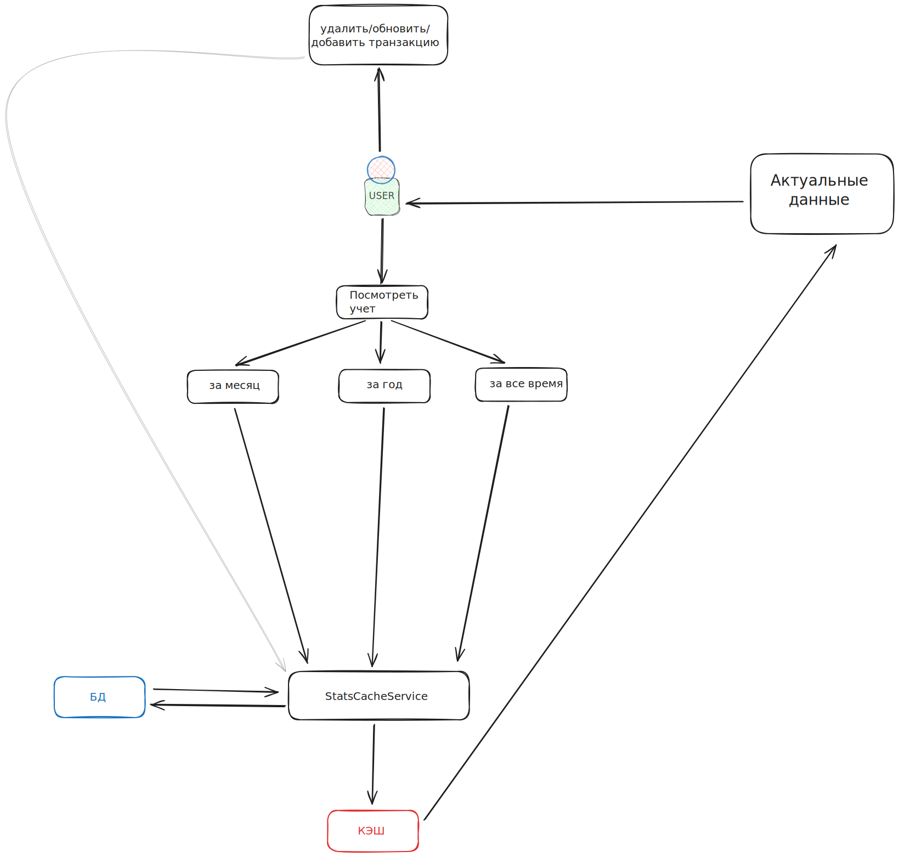

# Настройка

Запуск
```bash
docker compose up -d
```

Устанавливаем зависимости
```bash
docker compose run composer install
docker compose run composer require predis/predis
```

Ключ и миграции
```bash
docker compose run artisan key:generate
docker compose run artisan migrate
```

Заполнения данных
```bash
docker compose run artisan db:seed
```

Тестирование
```bash
docker compose run artisan test 
```

## Блок схемы




## Видео и скриншоты

https://drive.google.com/file/d/1qVHCpUHUgvuQRnOUgM1Hk_dNLubW0LOL/view?usp=sharing

https://drive.google.com/drive/folders/15mybtmtUMVO68eNsTVvQ_u5Yl56RrnLL?usp=sharing
